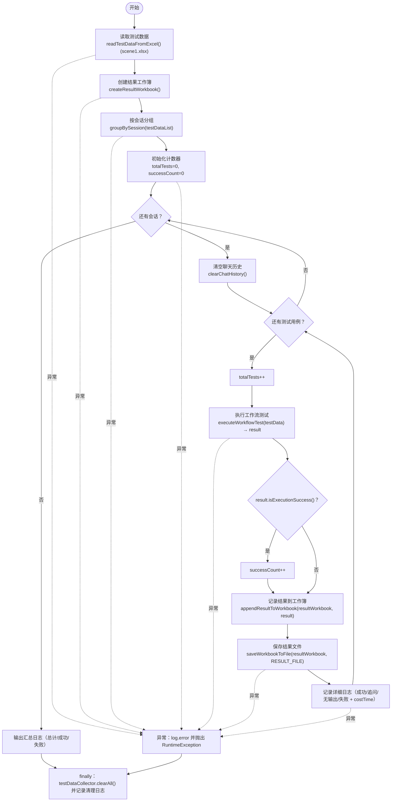

```mermaid
graph TD
S(["开始"])
A["读取测试数据<br/>readTestDataFromExcel() (scene1.xlsx)"]
B["创建结果工作簿<br/>createResultWorkbook()"]
C["按会话分组<br/>groupBySession(testDataList)"]
D["初始化计数器<br/>totalTests=0, successCount=0"]
E{"还有会话？"}
F["清空聊天历史<br/>clearChatHistory()"]
G{"还有测试用例？"}
H["totalTests++"]
I["执行工作流测试<br/>executeWorkflowTest(testData) → result"]
J{"result.isExecutionSuccess()？"}
K["successCount++"]
L["记录结果到工作簿<br/>appendResultToWorkbook(resultWorkbook, result)"]
M["保存结果文件<br/>saveWorkbookToFile(resultWorkbook, RESULT_FILE)"]
N["记录详细日志（成功/追问/无输出/失败 + costTime）"]
P["输出汇总日志（总计/成功/失败）"]
X["异常：log.error 并抛出 RuntimeException"]
Y["finally：testDataCollector.clearAll() 并记录清理日志"]

S --> A --> B --> C --> D --> E
E -->|"是"| F --> G
G -->|"是"| H --> I --> J
J -->|"是"| K --> L
J -->|"否"| L
L --> M --> N --> G
G -->|"否"| E
E -->|"否"| P --> Y

A -. "异常" .-> X
B -. "异常" .-> X
C -. "异常" .-> X
D -. "异常" .-> X
I -. "异常" .-> X
M -. "异常" .-> X
N -. "异常" .-> X
X --> Y
```